# CoaxSimX

> 项目基于 [Pegasus Simulator](https://github.com/PegasusSimulator/PegasusSimulator.git) 二次开发

## 环境搭建

- 系统推荐 Ubuntu20.04 / 22.04

### Miniconda

[安装教程](https://www.anaconda.com/docs/getting-started/miniconda/install#linux-2)

### 安装 Isaac Sim 4.5

- 注意版本是 4.5，后续可能会去适配 5.1

- 使用 conda 创建虚拟 python 环境，使用 python 3.10

[安装教程](https://docs.isaacsim.omniverse.nvidia.com/4.5.0/installation/install_python.html)

### 安装 ROS1（可选）

- 如果不需要使用 ROS 也可以不安装，把对应 backend 注释就好了（后续会解释） 

- ros2 也支持，但是我适配的是 ros1，ros2 要自行修改

[安装工具](https://fishros.org.cn/forum/topic/20/%E5%B0%8F%E9%B1%BC%E7%9A%84%E4%B8%80%E9%94%AE%E5%AE%89%E8%A3%85%E7%B3%BB%E5%88%97)

### Isaac Lab（可选）

- 如果后续想训练强化学习模型可以安装

[安装教程](https://isaac-sim.github.io/IsaacLab/main/source/setup/installation/pip_installation.html)

## 运行仿真 CoaxSimX

### 代码下载

```shell
git clone https://github.com/ShuWei-2024/CoaxSimX.git
cd CoaxSimX
```

- 修改 env.sh 中 env_isaaclab 为自己的虚拟环境名称

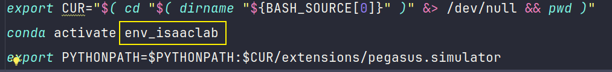

- 修改 extensions/pegasus.simulator/config/configs.yaml

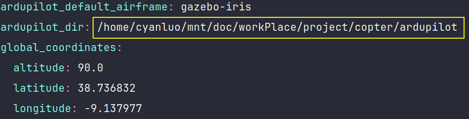

```shell
source env.sh
# 没有 ros 就不需要运行下面两句
source ros_env.sh
./roscore.sh
```

### 运行示例

#### 使用 APM 作为控制器

```shell
# 共轴
python examples/15_coaxcopter_ardupilot.py
# 四旋翼
python examples/11_ardupilot_multi_vehicle.py
```

> **注意：如果没有安装 ROS1 要把下面代码注释**
>
> 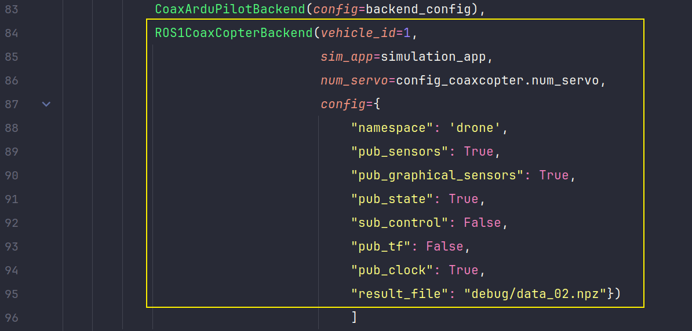

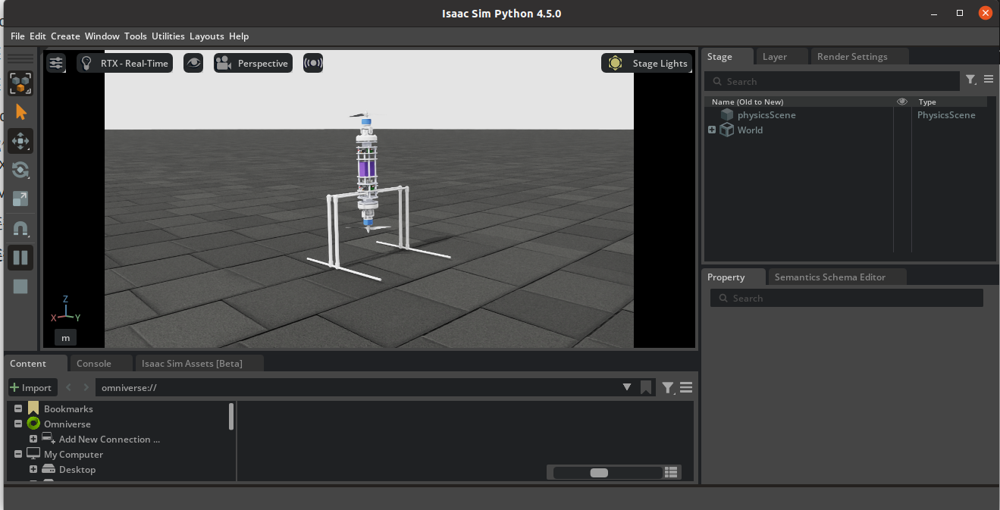

##### 1. 连接地面站

> 正常应该会自动使用 UDP 连接地面站，如果没有连接，可以用以下方法
>
> 注意使用 UDP 连接会限制 mavlink 数据流的发送频率，如果希望使用大的发送频率，比如 mavros 或者使用 pymavlink 连接时，如果希望比较大的发送频率，直接使用 TCP 连接串口，比如下图中的 SERIAL1 或者 SERIAL2

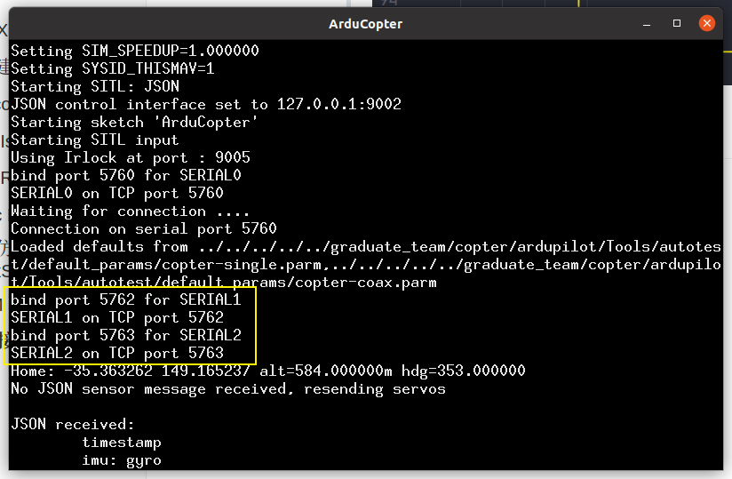

​	地面站使用 TCP 连接 apm 的串口，比如这里端口是 5762 和 5763，ip 是 127.0.0.1

- Mission Planner

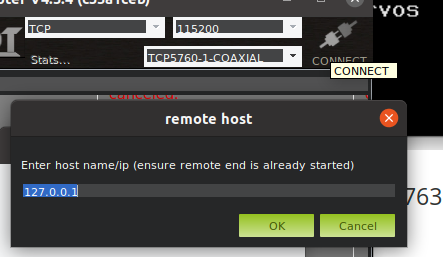

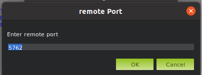

- QGC

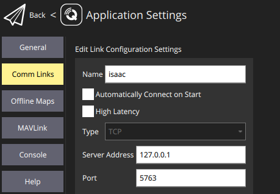

##### 2. 连接手柄

连接手柄必须使用 QGC，我测试 Mission Planner 的这个功能是有问题的

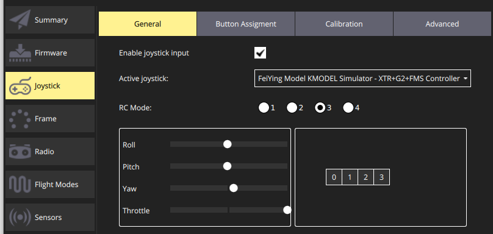

##### 3. 加载参数

共轴机型第一次运行要用 MissionPlanner 加载参数，参数放在 `extensions/pegasus.simulator/apm_param`


- coaxExternalNav 使用 VIO 外部定位的参数设置
- coaxGPS 使用 GPS 做 EKF 位置估计

#### 使用 controller 中的控制器

- 不使用 APM

```shell
# 共轴
python examples/15_coaxcopter_ardupilot.py
# 四旋翼
python examples/12_camera_vehicle_ros1.py 
```

### 多机仿真

- 可以参考示例 15 的实例化方法进行多次实例化即可实现，效果如下：

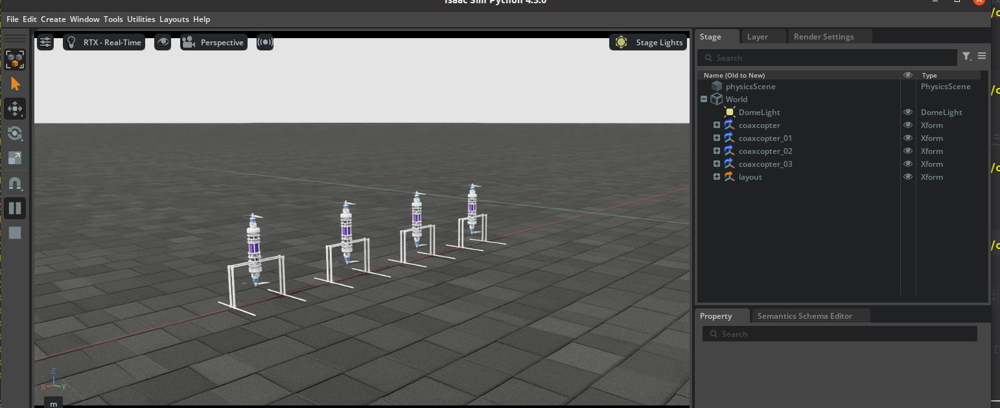

### 数据可视化

https://docs.isaacsim.omniverse.nvidia.com/4.5.0/physics/ext_isaacsim_inspect_physics.html

### 提高帧率

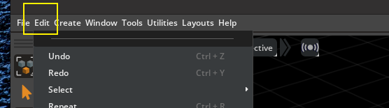

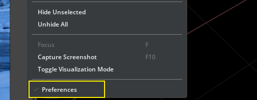

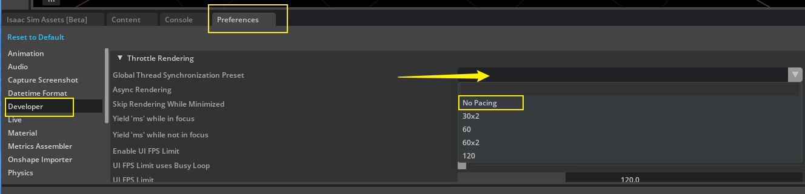

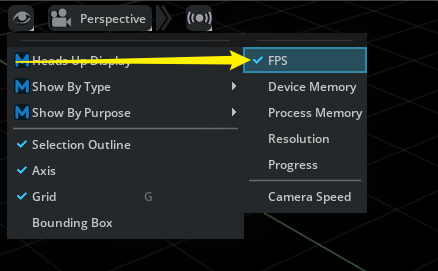

## 更换机型（solidworks 导出）

> **solidworks 模型最好都标明材质，导出的质量及惯性张量计算更加准确**

[插件安装](https://github.com/ros/solidworks_urdf_exporter.git)

[教程](https://blog.csdn.net/qq_54900679/article/details/137279115)（此教程导出无颜色，如果想要颜色按下面操作）

### 插件编译

​	官方给出的插件打包的 release 版本软件只支持输出 stl 文件，导致没有颜色等信息，最新的 commit 已经支持导出 3dxml 格式文件，所以要自行编译

#### 1. 下载源码

```bash
git clone git@github.com:ros/solidworks_urdf_exporter.git
```

#### 2. 安装 Visual Studio（我使用 VS2022 可以正常编译）

#### 3. 安装 .NET desktop development

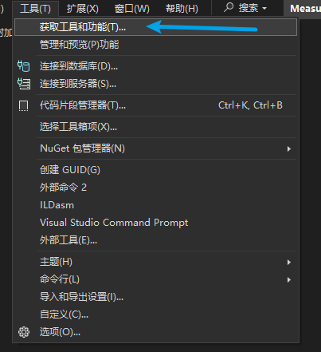

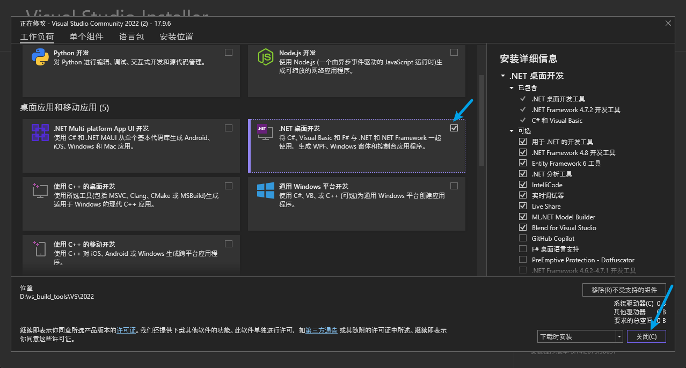

- 这里的 **关闭** 应该是 **修改**，因为我已经安装过了，所以显示的是 关闭

#### 4. 安装 [SolidWorks API tools](https://help.solidworks.com/2019/english/api/sldworksapiprogguide/GettingStarted/SolidWorks_API_Getting_Started_Overview.htm)

- 找到 SOLIDWORKS API SDK.msi
  - 我的是在 D:\sw24\SolidWorks2024 SP5(64bit)\Setup\apisdk
- 双击 SOLIDWORKS API SDK.msi 进行安装

#### 5. 打开工程

- 右击 VS 以管理员身份打开软件
- 打开`sw2urdf/SW2URDF.sln`
- 打开 解决方案窗口
  	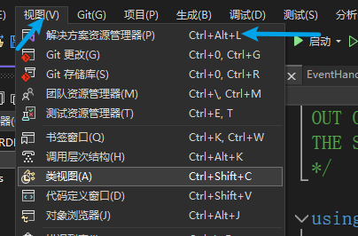
- 添加链接库

​	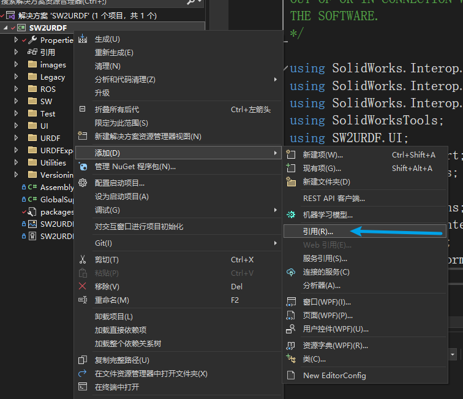

- 找到下面这些库并添加

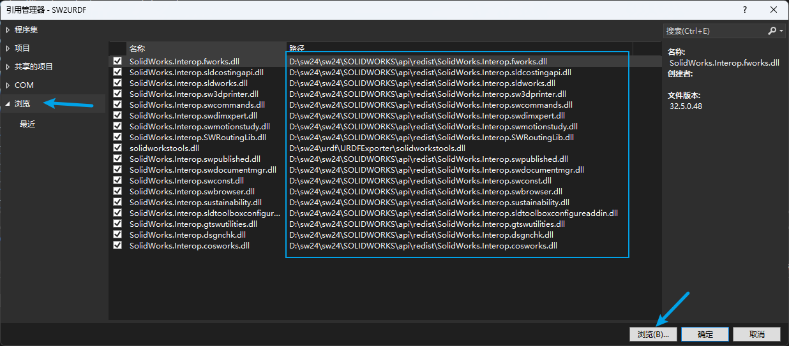

- 其中 solidworkstools.dll 是在下载的 release 软件里找到的

- 设置外部程序路径

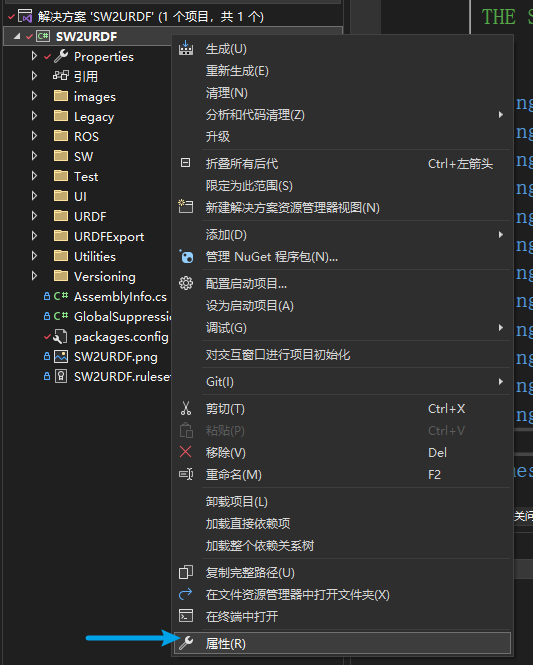

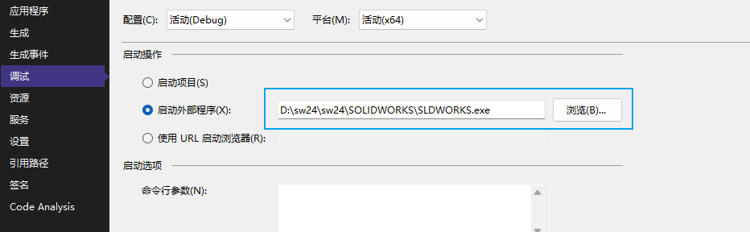

- 设置 Debug 并运行

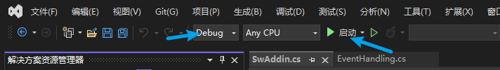

### 导出 urdf（meshes 用 3dxml 格式）

- 需要给每个 link 添加**参考点**和**坐标轴**，同时要给驱动关节添加 **基准轴**

#### 1. 添加参考点

- 注意：子 link 的参考点最好添加在父 link 上

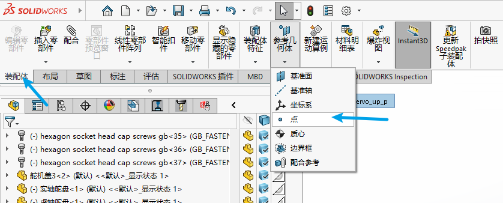

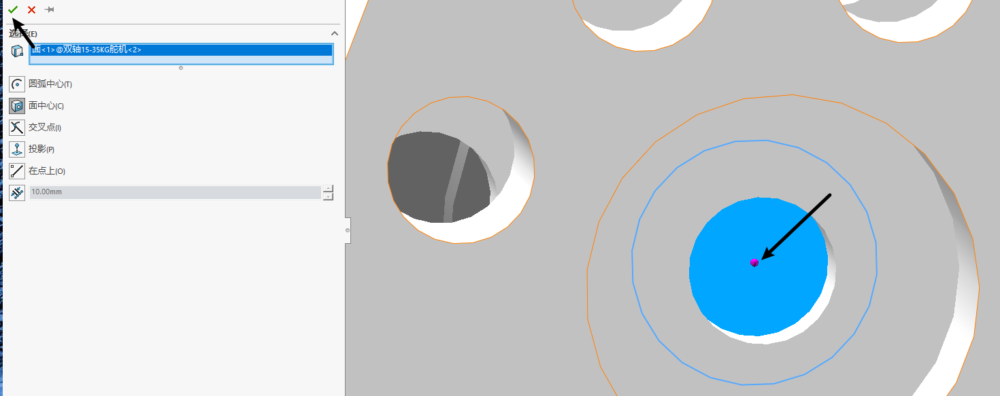

#### 2. 选中参考点，添加坐标系

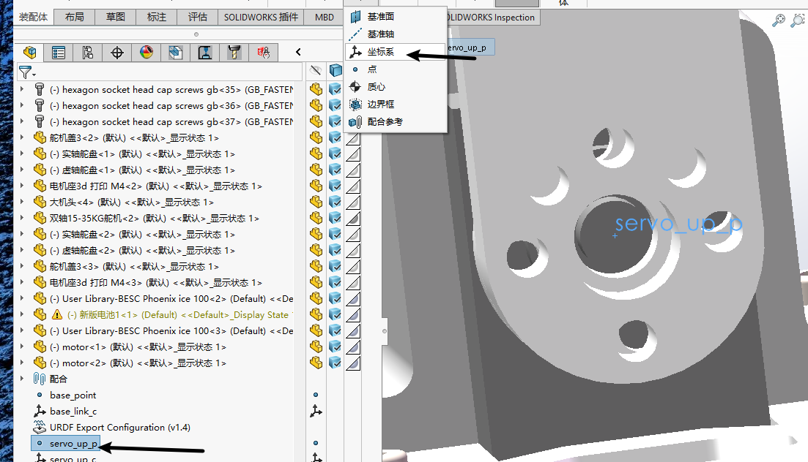

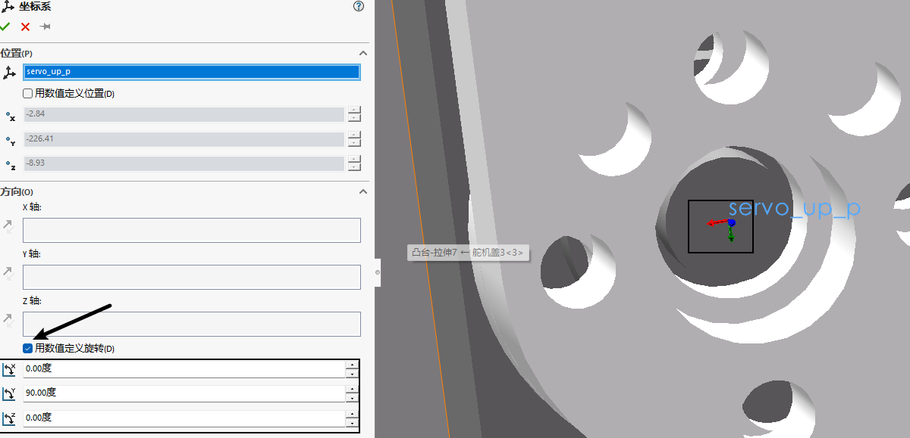

- 注意调整坐标系，一般base_link的话在 ros 中是 FLU 坐标系，而旋转link坐标系一般让 z 轴朝向旋转轴

#### 3. 添加基准轴

- 注意基准轴最好建在父 link 上

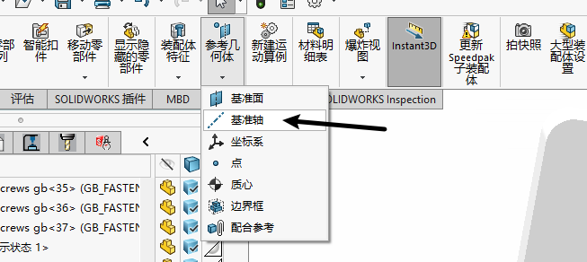

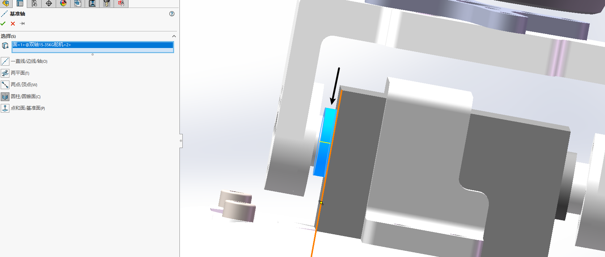

- 这里选择了父link(把舵机和整个框架做一个base_link)，舵盘绕着 base_link 上建立的旋转轴转

- 把所有的 link 都按照上面步骤添加

#### 4. 使用插件导出

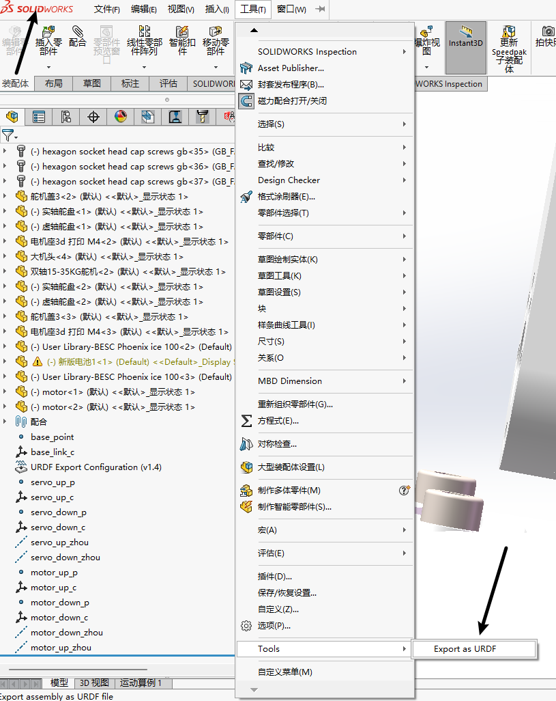

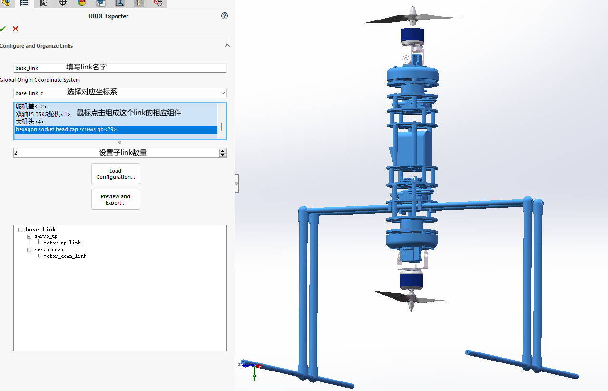

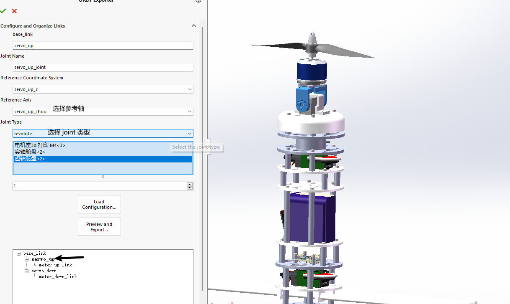

- 按照上面步骤依次设置好所有 link

- 点击 Preview and Export

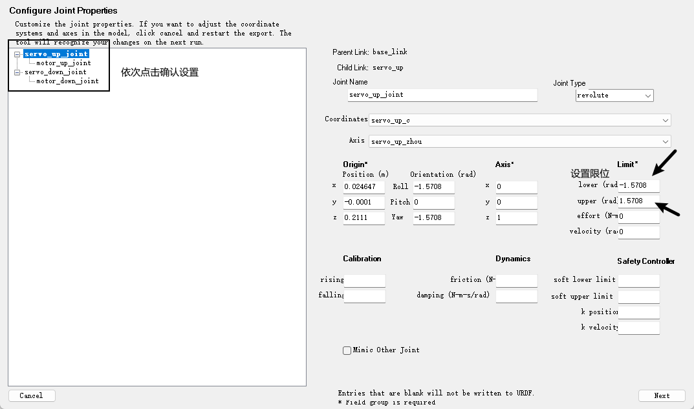

- 点击 Next

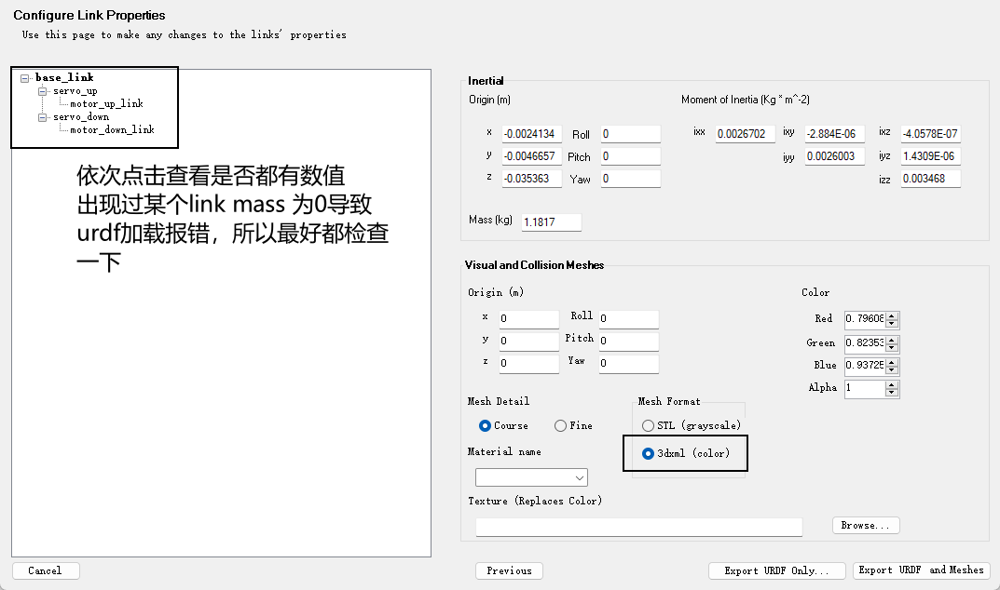

- 最后点击 Export URDF and Meshes

### 3dxml 转换 dae（以下操作都是在 linux 中进行）

```bash
# urdf 包路径 /home/cyanluo/mnt/doc/workPlace/project/LRX/DEVPlanner/3d/urdf/dumbbel

conda create -n urdf python=3.8
# 注意不要用插件 Readme 里给的命令，否则会安装最新版本，执行会报错,经测试0.0.45版本可行
pip3 install scikit-robot==0.0.45

convert-urdf-mesh <URDF_PATH> --output <OUTPUT_URDF_PATH>
# 注意下面命令会覆盖原 urdf文件，注意备份
# convert-urdf-mesh /home/cyanluo/mnt/doc/workPlace/project/LRX/DEVPlanner/3d/urdf/dumbbel/urdf/dumbbel.urdf --output /home/cyanluo/mnt/doc/workPlace/project/LRX/DEVPlanner/3d/urdf/dumbbel/urdf/dumbbel.urdf
```

### 查看转换结果

```bash
# 复制 urdf 包到 ros 工作空间
cp /home/cyanluo/mnt/doc/workPlace/project/LRX/DEVPlanner/3d/urdf/dumbbel /home/cyanluo/mnt/doc/workPlace/project/LRX/DEVPlanner/3d/urdf/workspace/src
cd ..
catkin_make
source devel/setup.bash
```

#### rviz 中查看

```bash
roslaunch dumbbel display.launch
```

- 修改 Fixed Frame

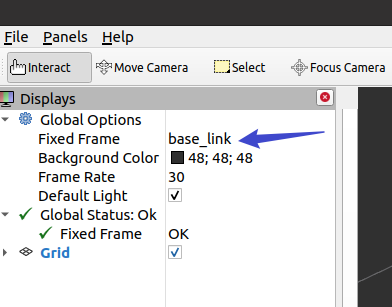

- 添加 RobotModel

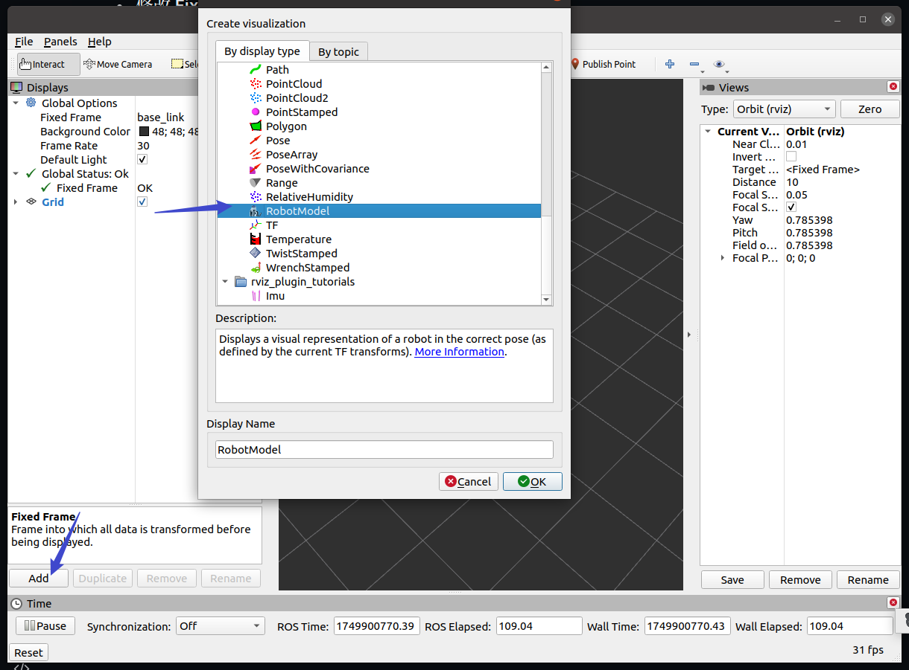
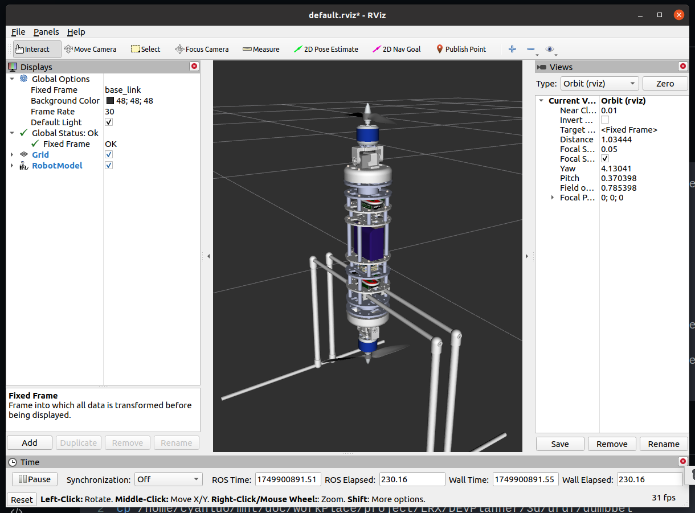

#### gazebo 中查看

```bash
roslaunch dumbbel gazebo.launch
```

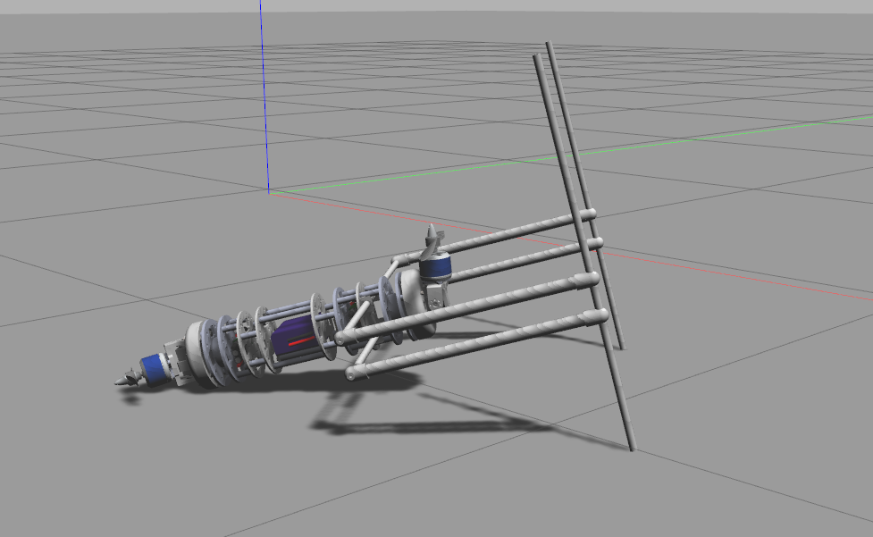

### 如果在 gazebo 启动中崩溃

> ```
> gzclient: /build/ogre-1.9-kiU5_5/ogre-1.9-1.9.0+dfsg1/OgreMain/include/OgreAxisAlignedBox.h:251: void Ogre::AxisAlignedBox::setExtents(const Ogre::Vector3&, const Ogre::Vector3&): Assertion (min.x <= max.x && min.y <= max.y && min.z <= max.z) && "The minimum corner of the box must be less than or equal to maximum corner"' failed.
> Aborted (core dumped)
> [gazebo_gui-3] process has died [pid 7227, exit code 134, cmd /opt/ros/noetic/lib/gazebo_ros/gzclient __name:=gazebo_gui __log:=/home/cyanluo/.ros/log/dc468aa8-48f1-11f0-b5e6-6b5097d621cb/gazebo_gui-3.log].
> log file: /home/cyanluo/.ros/log/dc468aa8-48f1-11f0-b5e6-6b5097d621cb/gazebo_gui-3*.log
> ```

- 这是转换出的 dae 文件有问题，可以使用 blender 转换

#### 使用 blender 转换

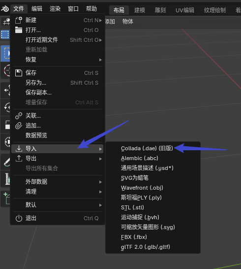

- 找到 urdf 包里的 meshes 文件夹，将里面的每个 dae 文件都按如下步骤操作

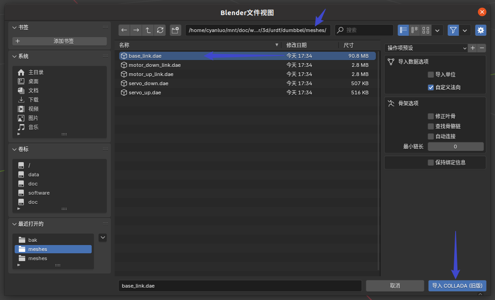

- 导入后按下面步骤操作，不要点别的地方以保持选中导入的 dae 

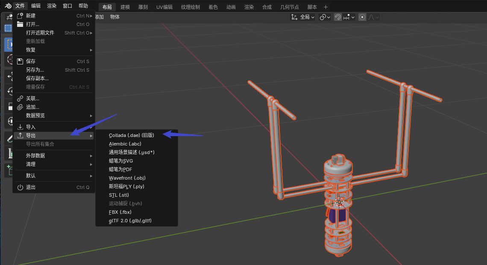

- 在 Blender 导出 `.dae` 或 `.stl` 时，勾选：

  - `Apply Transform` 

  - `Forward`: `-Z Forward`

  - `Up`: `Y Up`


- 这相当于将 Blender 的模型旋转到 Gazebo 的坐标系下再导出
- 导出的 dae 文件要覆盖原来的 dae 文件

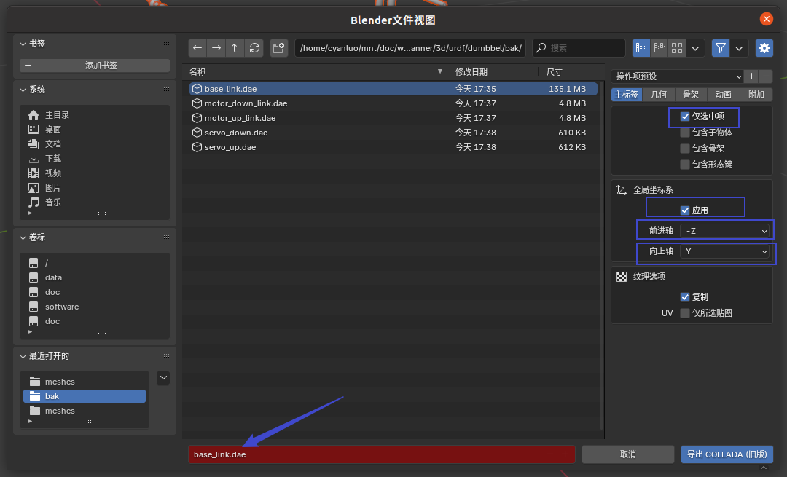

### 导入 Isaac Sim

https://docs.isaacsim.omniverse.nvidia.com/4.5.0/robot_setup/import_urdf.html

## 关节参数整定

导入的机器人模型各个 joint 默认添加了 Isaac 的关节驱动器，需要整定控制参数和做一些限幅

### 1. 打开 Isaac UI 导入模型

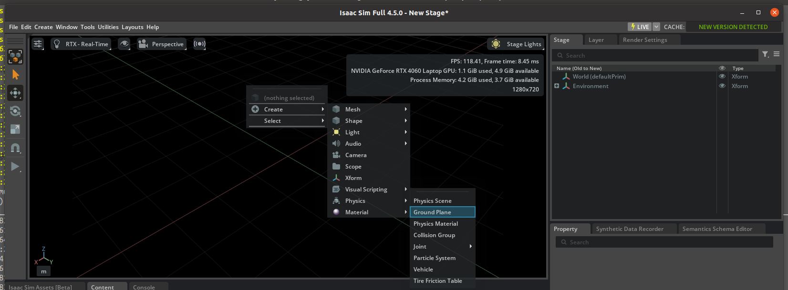

- 找到导出的模型直接拖入

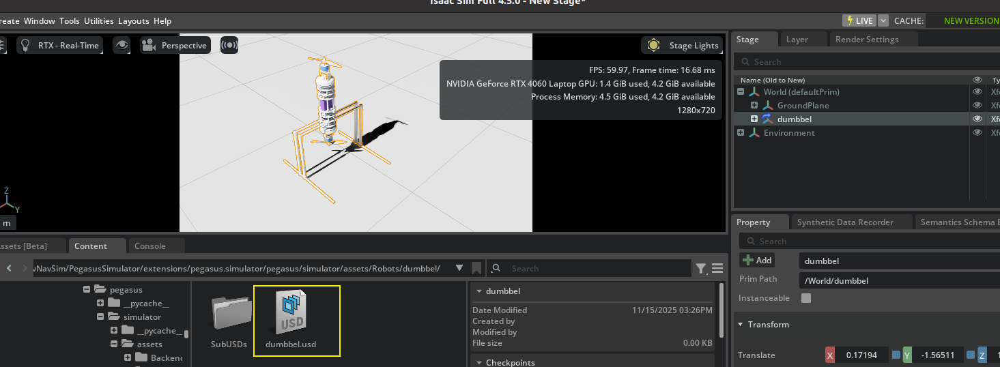

### 2. 打开参数整定工具

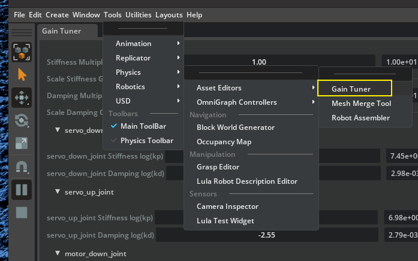

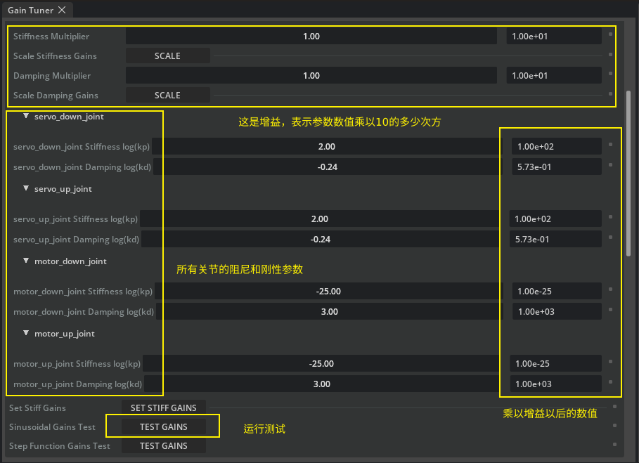

- 这里的 Stiffness 实际上就是位置控制的比例增益，Damping 就是速度控制的比例增益
- 如果是舵机，那么是位置控制，调大 Stiffness，适当给一些 Damping 防止振荡
- 如果是电机，那么注重速度控制，调大 Damping，减小 Stiffness

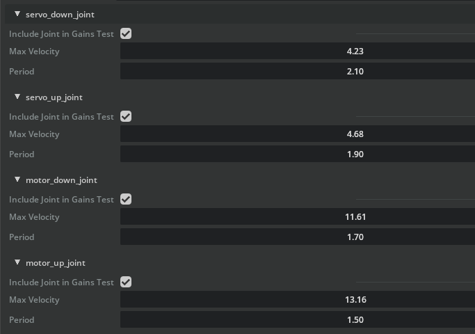

- 这里可以设置测试哪些关节及其最大速度，运行测试后可以看到跟踪效果

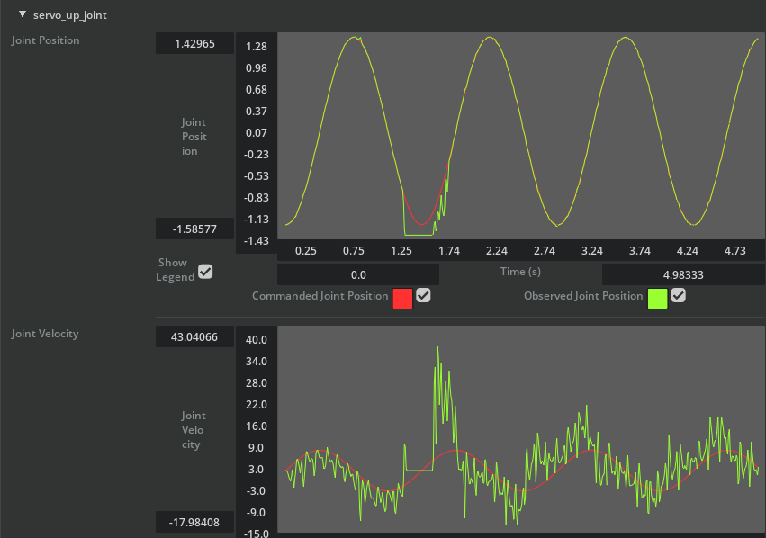

### 3. 关节力/力矩限幅

​	**这个非常重要，如果不进行限制，关节驱动器为了控制关节可能会施加巨大的力导致给机体施加大的反向力/力矩使得机器人难以控制**

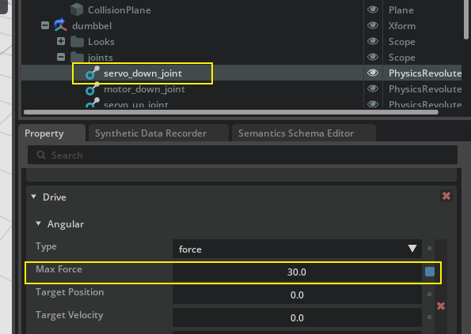

## 导出修改后的模型

- 选择模型跟节点 dumbbel

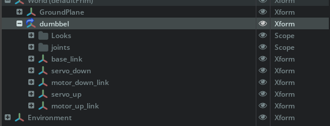

- 在选中 Prim 的情况下打开菜单Edit，然后点击 Unparent

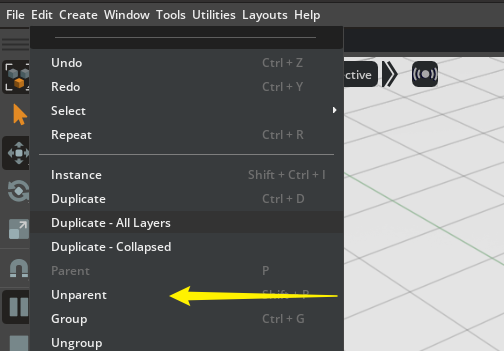

- 确认 dumbbel 不再位于 World 之下，而是和 World 平行

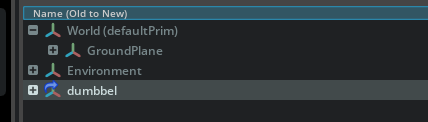

- 右键点击机器人 Prim，然后选择 *设为默认 Prim（Set as a Default Prim）*，保存

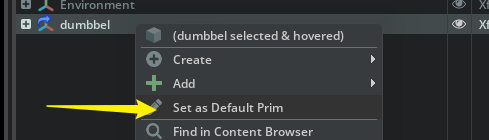

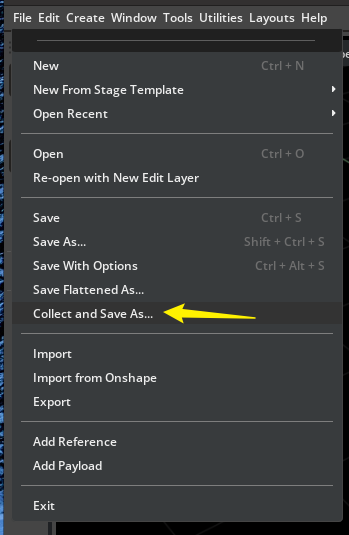

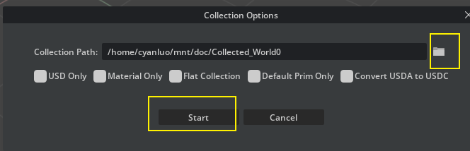

- 打开一个新环境，并将保存的文件模型再次导入进行验证

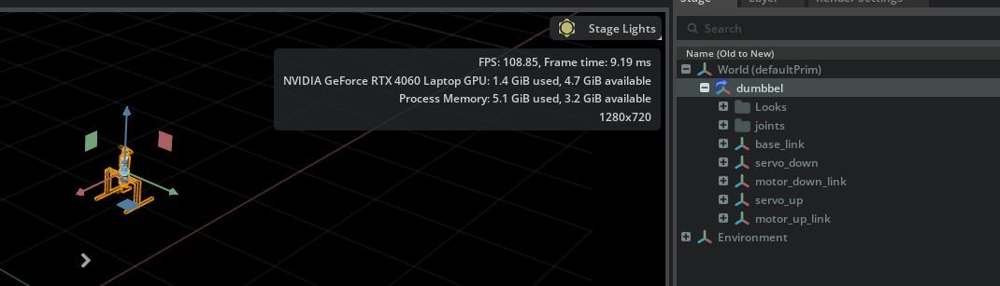

## 旋翼参数修改

- 由于 Isaac Sim 中不支持空气动力的模拟，所以旋翼模型要手动实现

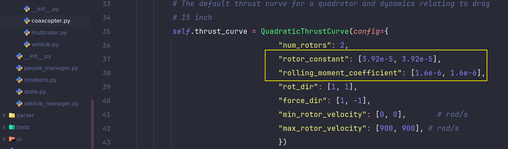

### 升力系数和力矩系数计算

> 这里用的旋翼模型比较简单，如果需要更精确到模型可以直接重写更换上面的类

假设：D = 0.381 m（15 in），$\rho=1.225\ \mathrm{kg/m^3}$，n = 100 rps（即 6000 rpm），取一个中等 $C_T=0.06$、$C_P=0.04$ 来示范：

- $D^4 \approx 0.0210717$

- 推力：
  $$
  T = C_T\,\rho\,n^2\,D^4 = 0.06 \times 1.225 \times 100^2 \times 0.0210717 \approx 15.49\ \mathrm{N} \\
  C_{force} = \frac{C_T\,\rho D^4}{(2\pi)^2}
  $$
  （约等于 1.58 kgf）。

- 如果 $C_P=0.04$，则 $C_Q = C_P/(2\pi)\approx 0.00637$，力矩
  $$
  Q = C_Q\,\rho\,n^2\,D^5 \approx 0.626\ \mathrm{N\cdot m}. \\
  C_{moment} = \frac{C_Q\,\rho D^5}{(2\pi)^2}
  $$

## 一些开发笔记

### TF

#### scipy.spatial.transform

```python
from scipy.spatial.transform import Rotation as R

# 第一个参数大写表示非固定轴，小写表示固定轴
# XYZ 表示 XYZ 的非固定轴转
a = R.from_euler('XYZ', [90, -91, 0], degrees=True)
# zyx 表示 zyx 的固定轴转
b = R.from_euler('zyx', [0, -91, 90], degrees=True)

print(a.as_euler("zyx", degrees=True))
print(b.as_euler('XYZ', degrees=True))
print(a.as_matrix())
print(b.as_matrix())
# return 格式 [x, y, z, w]
print(a.as_quat())
print(b.as_quat())
```

> ```
> [-180.  -89.  -90.]
> [ -90.  -89. -180.]
> [[-1.74524064e-02  0.00000000e+00 -9.99847695e-01]
> [-9.99847695e-01  2.22044605e-16  1.74524064e-02]
> [ 2.22044605e-16  1.00000000e+00  0.00000000e+00]]
> [[-1.74524064e-02  0.00000000e+00 -9.99847695e-01]
> [-9.99847695e-01  2.22044605e-16  1.74524064e-02]
> [ 2.22044605e-16  1.00000000e+00  0.00000000e+00]]
> [ 0.49561769 -0.50434423 -0.50434423  0.49561769]
> [ 0.49561769 -0.50434423 -0.50434423  0.49561769]
> ```

#### isaac 中的欧拉角定义

​	isaac 中欧拉角是用 XYZ 的非固定轴转定义的：

​		
​	

```python
c = R.from_euler('xyz', [10, 20, 10], degrees=True)
d = R.from_euler('XYZ', [10, 20, 10], degrees=True)
print(c.as_quat())
print(d.as_quat())
```

> ```
> [0.07042819 0.17980985 0.07042819 0.97864608]
> [0.10058188 0.1648484  0.10058188 0.97600798]
> ```

​	上面输出的是 [x, y, z, w]，可以看到只有 XYZ 转法才符合，所以 isaac 中欧拉角是用 XYZ 的非固定轴转定义的。

#### 获取两个 prim 间的 transform

```python
def get_relative_transform(source_prim: Usd.Prim, target_prim: Usd.Prim) -> np.ndarray:
    """Get the relative transformation matrix from the source prim to the target prim.

    Args:
        source_prim (Usd.Prim): source prim from which frame to compute the relative transform.
        target_prim (Usd.Prim): target prim to which frame to compute the relative transform.

    Returns:
        np.ndarray: Column-major transformation matrix with shape (4, 4).
    """
```

​	**注意：用上述函数得到的变换矩阵是 $^{target\_prim}_{source\_prim}T$** 

###### 获取 body 到 camera 的变换，使用 ros 发布

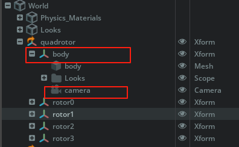

```python
import isaacsim.core.utils.prims as prims_utils
import isaacsim.core.utils.transformations as transformations_utils

self.vehicle._stage_prefix = "/World/quadrotor"
body_prim = prims_utils.get_prim_at_path(self.vehicle._stage_prefix + "/body")
trans_matrix = transformations_utils.get_relative_transform(prims_utils.get_prim_at_path(self.vehicle._stage_prefix + "/body/camera"), body_prim)
trans, rot_q = transformations_utils.pose_from_tf_matrix(trans_matrix)
t = TransformStamped()
t.header.stamp = rospy.Time.now()
t.header.frame_id = self._namespace + '_' + "base_link"
t.child_frame_id = e.rpartition("/")[-1]
t.transform.translation.x = trans[0]
t.transform.translation.y = trans[1]
t.transform.translation.z = trans[2]
t.transform.rotation.x = rot_q[1]
t.transform.rotation.y = rot_q[2]
t.transform.rotation.z = rot_q[3]
t.transform.rotation.w = rot_q[0]

self.tf_static_broadcaster.sendTransform(t)
```

#### 使用 og 发布 tf

```python
try:
    og.Controller.edit(
        {"graph_path": "/ActionGraph", "evaluator_name": "execution"},
        {
            og.Controller.Keys.CREATE_NODES: [
                ("PublishTF", "isaacsim.ros1.bridge.ROS1PublishTransformTree"),
                ("OnImpulseEvent", "omni.graph.action.OnImpulseEvent"),
                ("ReadSimTime", "isaacsim.core.nodes.IsaacReadSimulationTime"),
            ],
            og.Controller.Keys.CONNECT: [
                ("OnImpulseEvent.outputs:execOut", "PublishTF.inputs:execIn"),
                ("ReadSimTime.outputs:simulationTime", "PublishTF.inputs:timeStamp"),
            ],
            og.Controller.Keys.SET_VALUES: [
                ("PublishTF.inputs:parentPrim", self._vehicle._stage_prefix + "/body"),
                ("PublishTF.inputs:targetPrims", [self._vehicle._stage_prefix + "/body/camera", self._vehicle._stage_prefix + "/rotor0"]),
            ],
        },
    )
except Exception as e:
    print(e)
    self.sim_app.close()
    exit()

# 手动发布
og.Controller.set(og.Controller.attribute("/ActionGraph/OnImpulseEvent.state:enableImpulse"), True)

```

#### ros 中欧拉角定义

```python
f = R.from_quat(tf.transformations.quaternion_from_euler(rad(20) , rad(20), rad(10)))
print(f.as_euler("xyz", degrees=True))
```

> ```
> [20. 20. 10.]
> ```

​	在 ros 中欧拉角是以 xyz 固定轴转定义的，等价于 ZYX 的非固定轴转，这与 isaac 中的定义不同

##### 欧拉角定义不同，那么 isaac 四元素发送给 ros 需要转换吗

​	答案是不需要：

```python
import matplotlib.pyplot as plt
from scipy.spatial.transform import Rotation as R
import numpy as np
import tf

def plot_rotated_axes(ax, r, name=None, offset=(0, 0, 0), scale=1):
    colors = ("#FF6666", "#005533", "#1199EE")  # Colorblind-safe RGB
    loc = np.array([offset, offset])
    for i, (axis, c) in enumerate(zip((ax.xaxis, ax.yaxis, ax.zaxis),
                                      colors)):
        axlabel = axis.axis_name
        axis.set_label_text(axlabel)
        axis.label.set_color(c)
        axis.line.set_color(c)
        axis.set_tick_params(colors=c)
        line = np.zeros((2, 3))
        line[1, i] = scale
        line_rot = r.apply(line)
        line_plot = line_rot + loc
        ax.plot(line_plot[:, 0], line_plot[:, 1], line_plot[:, 2], c)
        text_loc = line[1]*1.2
        text_loc_rot = r.apply(text_loc)
        text_plot = text_loc_rot + loc[0]
        ax.text(*text_plot, axlabel.upper(), color=c,
                va="center", ha="center")
    ax.text(*offset, name, color="k", va="center", ha="center",
            bbox={"fc": "w", "alpha": 0.8, "boxstyle": "circle"})

ax = plt.figure().add_subplot(projection="3d", proj_type="ortho")
ax.set(xlim=(-1.25, 7.25), ylim=(-1.25, 1.25), zlim=(-1.25, 1.25))
ax.set(xticks=range(-1, 11), yticks=[-1, 0, 1], zticks=[-1, 0, 1])
ax.set_aspect("equal", adjustable="box")
ax.figure.set_size_inches(9, 5)

# a 模拟 isaac 要发布给 ros 的四元素
a = R.from_euler('XYZ', [80, 60, 30], degrees=True)
print(a.as_euler('XYZ', degrees=True))
# 查看要发布的四元素
print(a.as_quat())
# ros 中接收到四元素并解算（这里按照 xyz 解算）
d = [math.degrees(r) for r in tf.transformations.euler_from_quaternion(a.as_quat())]
print(d)
# 用于画图，这里使用 ros 的欧拉角定义， 使用 xyz 旋转
d = R.from_euler('xyz', d, degrees=True)
# 查看对应的四元素
print(d.as_quat())

plot_rotated_axes(ax, a, name="Oa", offset=(0, 0, 0))
plot_rotated_axes(ax, d, name="Ob", offset=(3, 0, 0))
plt.tight_layout()
plt.show()
```

> ```
> isaac 中 roll pitch yaw: [80. 60. 30.]
> 发布给ros的四元素： [0.63683576 0.22589415 0.48214674 0.55762583]
> ros 中 roll pitch yaw: [84.6552873210216, -21.23338437706145, 62.31892245800993]
> ros 中进行解算的四元素： [0.63683576 0.22589415 0.48214674 0.55762583]
> ```

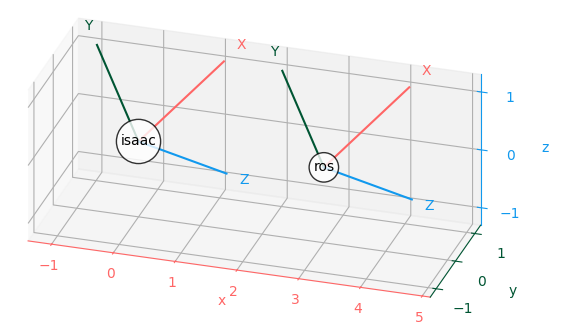

​	之所以解算出的欧拉角不一致，是因为它们的定义不一致，但按照各自定义去旋转最终的姿态是一致的

### 与 ROS 时间戳对齐

#### 时间戳重复问题

```python
if self._pub_clock:
    clock_topic = "clock"

    try:
        og.Controller.edit(
            {"graph_path": "/ActionGraph", "evaluator_name": "execution"},
            {
                og.Controller.Keys.CREATE_NODES: [
                    ("ReadSimTime", "isaacsim.core.nodes.IsaacReadSimulationTime"),
                    ("OnPlaybackTick", "omni.graph.action.OnPlaybackTick"),
                    ("PublishClock", "isaacsim.ros1.bridge.ROS1PublishClock"),
                ],
                og.Controller.Keys.CONNECT: [
                    # Connecting execution of OnPlaybackTick node to PublishClock  to automatically publish each frame
                    ("OnPlaybackTick.outputs:tick", "PublishClock.inputs:execIn"),
                    # Connecting simulationTime data of ReadSimTime to the clock publisher nodes
                    ("ReadSimTime.outputs:simulationTime", "PublishClock.inputs:timeStamp"),
                ],
                og.Controller.Keys.SET_VALUES: [
                    # Assigning topic names to clock publishers
                    ("PublishClock.inputs:topicName", clock_topic),
                ],
            },
        )
    except Exception as e:
        print(e)
        sim_app.close()
        exit()

        rospy.set_param("/use_sim_time", True)
```

> ```
> header: 
> seq: 253
> stamp: 
>  secs: 7
>  nsecs: 691667068
> frame_id: "drone_base_link_frd"
> ---
> header: 
> seq: 254
> stamp: 
>  secs: 7
>  nsecs: 691667068
> frame_id: "drone_base_link_frd"
> header: 
> seq: 255
> stamp: 
>  secs: 7
>  nsecs: 691667068
> frame_id: "drone_base_link_frd"
> ---
> header: 
> seq: 256
> stamp: 
>  secs: 7
>  nsecs: 691667068
> frame_id: "drone_base_link_frd"
> ---
> header: 
> seq: 257
> stamp: 
>  secs: 7
>  nsecs: 708333735
> frame_id: "drone_base_link_frd"
> ---
> header: 
> seq: 258
> stamp: 
>  secs: 7
>  nsecs: 708333735
> frame_id: "drone_base_link_frd"
> ```

​	从上面的结果可以看ros接收到传感器的时间戳重复了

​	原因是利用下面这种 ROS1PublishClock action graph 的方式发送 /clock，其发送的条件是 OnPlaybackTick.outputs:tick 输出，而 OnPlaybackTick.outputs:tick 触发的条件是 render 被调用

但是，传感器的发送是在每个 physics tick 上被注册的回调函数更新发送到，并不是在 render tick 下发送的，而 physics 的更新频率一般都要高于 render 的更新频率，而且为了能够在 ros 端能够得到更高频率的传感器数据，我们希望在 physisc tick 下去发送数据

```python
# Add a callback to the physics engine to update the current state of the system
self._world.add_physics_callback(self._stage_prefix + "/state", self.update_state)
```

#### 解决方案

​	使用 rospy 自定义发送 /clock，可以通过 *self*.pg.world.current_time 得到仿真时间

```python
clock_topic = "clock"
self.clock_pub = rospy.Publisher(clock_topic, Clock, queue_size=1000)

rospy.set_param("/use_sim_time", True)

if self._pub_clock:
    self.clock_pub.publish(rospy.Time.from_sec(self.pg.world.current_time))
```
